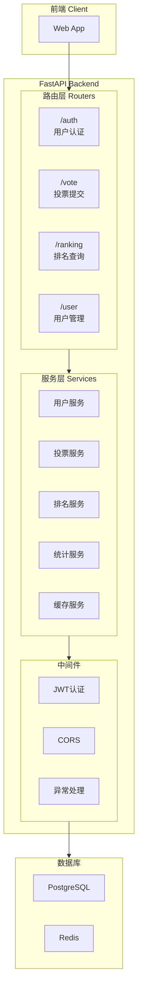

# FastAPI 重构待办事项清单

> 来源：原位于仓库根目录，2026-04-27 移入 `docs/`（按 CLAUDE.md §2「文档统一收敛到 docs/」）。
> 内容是预先存在的工作记录，未对其内部状态做修订；用户与认证模块的实际进度以 `docs/superpowers/specs/2026-04-27-user-auth-implementation-report.md` 为准。

## 一、项目基础架构（优先级：高）

### 1.1 项目初始化与配置（status: completed, waiting test）

- 完善 `pyproject.toml` 添加必要依赖：
  - FastAPI + Uvicorn
  - Pydantic (数据验证)
  - SQLAlchemy (ORM)
  - asyncpg (异步PostgreSQL驱动)
  - Redis/aioredis (缓存)
  - PyJWT (JWT认证)
  - python-dotenv (环境变量)
  - pytest/pytest-asyncio (测试)
- 创建 `config.py` 统一配置管理：
  - 数据库连接 (PostgreSQL)
  - Redis连接
  - JWT密钥配置
  - 投票时间配置
  - 服务端口
- 创建 `.env.example` 环境变量模板

### 1.2 数据库层（status: completed, waiting test）

- 完善 `db_model/base.py` 添加数据库会话管理（completed, waiting test）
- 创建 `database.py` 数据库连接和会话工厂（completed, waiting test）
- 创建数据库迁移脚本（使用 Alembic）
- 补充缺失的数据库模型：
  - 完整的 User 模型（含IP、注册时间）
  - Vote 模型（投票记录）（已通过 `raw_*` 提交表实现，completed, waiting test）
  - DojinSubmit 模型（completed, waiting test）
  - ActivityLogEntry 模型（活动日志）

### 1.3 主入口文件（status: completed, waiting test）

- 实现 `main.py`：
  - FastAPI 应用初始化
  - 数据库会话依赖注入
  - 路由注册
  - 中间件配置（CORS、异常处理）
  - 健康检查端点

---

## 二、用户管理模块（User Manager）- 优先级：高

### 2.1 用户认证

- 实现 `app_router/user.py` 或 `app_router/auth.py`：
  - `POST /v1/login-email-password` - 邮箱+密码登录
  - `POST /v1/login-email` - 仅邮箱登录
  - `POST /v1/login-phone` - 手机号+短信验证码登录
  - `POST /v1/register` - 用户注册
  - `POST /v1/send-sms-code` - 发送短信验证码
  - `POST /v1/send-email-code` - 发送邮箱验证码

### 2.2 用户信息管理

- 实现用户资料更新端点：
  - `POST /v1/update-email` - 更新邮箱
  - `POST /v1/update-phone` - 更新手机号
  - `POST /v1/update-nickname` - 更新昵称
  - `POST /v1/update-password` - 更新密码

### 2.3 Token 与会话

- 实现 JWT 认证逻辑
- `GET /v1/user-token-status` - 检查Token状态
- `POST /v1/remove-voter` - 删除账户

### 2.4 第三方登录（可选）

- THBWiki OAuth 登录集成
- QQ账号绑定功能

---

## 三、投票提交模块（Submit Handler）- 优先级：高

### 3.1 角色投票（status: completed, waiting test）

- 实现 `app_router/vote.py` 或 `app_router/submit.py`：
  - `POST /v1/character/` - 提交角色投票
  - `GET /v1/get-character/` - 获取角色提交记录
  - `GET /v1/voting-status/` - 检查投票状态

### 3.2 音乐投票（status: completed, waiting test）

- `POST /v1/music/` - 提交音乐投票

### 3.3 CP投票（status: completed, waiting test）

- `POST /v1/cp/` - 提交角色配对投票

### 3.4 问卷投票（status: completed, waiting test）

- `POST /v1/paper/` - 提交问卷/问卷投票

### 3.5 同人作品投票（status: completed, waiting test）

- `POST /v1/dojin/` - 提交同人作品投票

### 3.6 验证逻辑（status: partial completed, waiting test）

- 实现 `services/validator.py` - 投票验证（completed, waiting test）
- 实现 `services/paper_validator.py` - 问卷验证（completed, waiting test）
- 投票时间限制验证
- 重复投票检测

---

## 四、结果查询模块（Result Query）- 优先级：中

### 4.1 排名查询

- 实现 `app_router/ranking.py`：
  - `GET /v1/chars-rank/` - 角色排名
  - `GET /v1/musics-rank/` - 音乐排名
  - `GET /v1/cps-rank/` - CP排名

### 4.2 投票原因查询

- `GET /v1/chars-reasons/` - 角色投票原因
- `GET /v1/musics-reasons/` - 音乐投票原因
- `GET /v1/cps-reasons/` - CP投票原因

### 4.3 趋势分析

- `GET /v1/chars-trend/` - 角色投票趋势
- `GET /v1/musics-trend/` - 音乐投票趋势
- `GET /v1/cps-trend/` - CP投票趋势

### 4.4 统计信息

- `GET /v1/global-stats/` - 全局统计数据
- `GET /v1/completion-rates/` - 投票完成率
- `GET /v1/papers/` - 问卷数据

### 4.5 共现投票分析

- `GET /v1/chars-covote/` - 角色共现投票模式
- `GET /v1/musics-covote/` - 音乐共现投票模式

### 4.6 解析器（可选）

- 实现 `services/parser.py` - Pest PEG解析器（如需要高级查询语法）

---

## 五、缓存层（Redis）- 优先级：中

### 5.1 缓存服务

- 创建 `services/cache.py` 或 `services/redis_service.py`
- 缓存排名结果
- 缓存全局统计
- 缓存失效策略

### 5.2 分布式锁

- 实现 RedLock 机制防止并发投票问题
- 投票提交锁

---

## 六、GraphQL支持 - 优先级：高（进行中）

### 6.1 GraphQL端点（进行中）

- 添加 `strawberry-graphql` 依赖（已完成）
- 实现 `app_router/graphql/` 目录（已完成）
  - `types.py` - GraphQL 类型定义（已完成）
  - `schema.py` - 主Schema，含Query和Mutation（已完成）
  - `__init__.py` - 模块导出（已完成）
- `/graphql` 端点（已完成）
- `/playground` 图形化界面（待添加）

### 6.2 GraphQL模块

- `graphql/schema.py` - 主Schema（已完成）
- `graphql/types.py` - GraphQL 类型定义（已完成）
- 支持的Query:
  - `get_character_submit(voteId)` - 获取角色提交
  - `get_music_submit(voteId)` - 获取音乐提交
  - `get_cp_submit(voteId)` - 获取CP提交
  - `get_paper_submit(voteId)` - 获取问卷提交
  - `get_dojin_submit(voteId)` - 获取同人作品提交
  - `get_voting_status(voteId)` - 获取投票状态
  - `get_voting_statistics` - 获取投票统计
- 支持的Mutation:
  - `submitCharacter(input)` - 提交角色投票
  - `submitMusic(input)` - 提交音乐投票
  - `submitCP(input)` - 提交CP投票
  - `submitPaper(input)` - 提交问卷
  - `submitDojin(input)` - 提交同人作品

---

## 七、服务层（Services）- 优先级：高

### 7.1 业务逻辑服务

- 创建 `services/` 目录
- `services/user_service.py` - 用户服务
- `services/vote_service.py` - 投票服务
- `services/ranking_service.py` - 排名服务
- `services/statistics_service.py` - 统计服务

### 7.2 错误处理

- 创建 `errors.py` 或 `exceptions.py` 统一错误类
- 自定义异常处理器

---

## 八、测试

### 8.1 单元测试

- 添加 pytest 配置
- 各服务的单元测试
- DAO模型测试

### 8.2 集成测试

- API端点测试
- 数据库集成测试
- Redis缓存测试

---

## 九、部署与运维

### 9.1 Docker支持

- 创建 `Dockerfile`
- 创建 `docker-compose.yml`
- 环境配置

### 9.2 文档

- API 文档（Swagger/OpenAPI）
- README.md 更新

---

## 十、现有代码清理与完善

### 10.1 现有DAO模型完善

- 检查 `dao/` 中所有模型是否完整
- 补充缺失的 DAO 类：
  - `Trends.py` - 趋势数据
  - `CPSubmit.py` - CP提交数据
  - `SingleQuery.py` - 单项查询
  - `QuestionnaireTrendQuery.py` - 问卷趋势

### 10.2 现有db_model完善

- 确保所有模型的外键关系正确
- 添加必要的索引

### 10.3 app_router完善

- 补充完整的路由框架
- 实现所有定义的端点

---

## 总体架构图

## 当前状态总结

| 模块      | 完成度 | 备注           |
| ------- | --- | ------------ |
| 项目结构    | 75% | 基础架构已完成，删除旧文件（dao/services/app_router）  |
| 数据库模型   | 65% | 通用关系型连接 + raw submit模型已完成，待测试  |
| DAO模型   | 50% | 大部分已定义       |
| 路由层     | 45%  | submit-handler 路由已实现，待测试 |
| 服务层     | 35%  | submit service/validator/rate limit 已实现，待测试 |
| 缓存层     | 0%  | 未开始          |
| 用户认证    | 0%  | 未开始          |
| GraphQL | 80% | 已完成类型定义和解析器，待测试  |
| 测试      | 0%  | 未开始          |

建议按照优先级：**基础架构 → 用户管理 → 投票提交 → 结果查询 → 缓存优化 → GraphQL** 的顺序进行开发。
